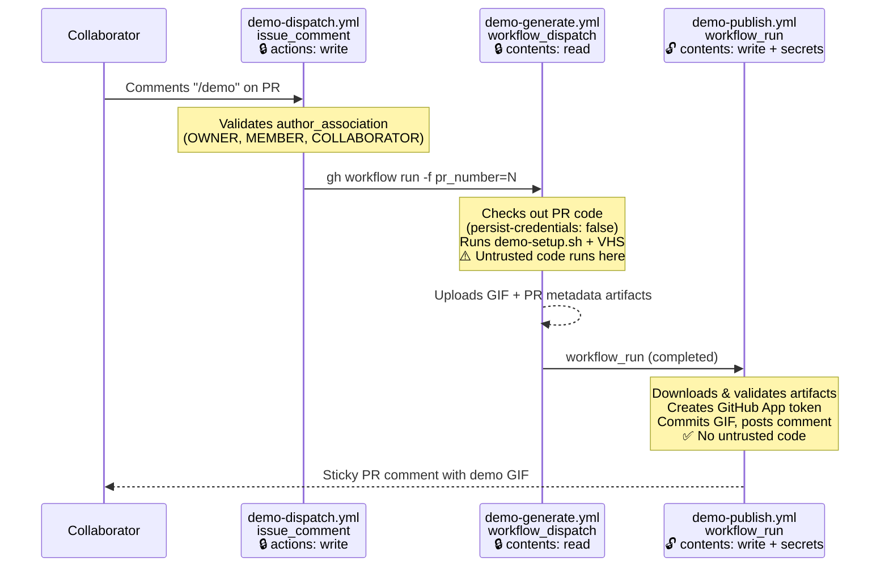

# Demo

The `demo.gif` in the project README is generated on-demand, by commenting "/demo" on a pull request.

## How It Works

- **[demo-setup.sh](demo-setup.sh)** - Builds the CLI executable and creates a demo environment. Run from the repo root:
  ```sh
  docs/demo-setup.sh
  ```
- **[demo.tape](demo.tape)** - A [VHS](https://github.com/charmbracelet/vhs) script that records a terminal session as a GIF.

## Pitfalls of Writing to Pull Requests

The demo workflow needs to run on a pull request and write to the same PR branch. This introduces 3 interconnected challenges:

1. **Triggering workflow runs**. By [design](https://docs.github.com/en/actions/how-tos/write-workflows/choose-when-workflows-run/trigger-a-workflow#triggering-a-workflow-from-a-workflow), a commit by GitHub Actions's token cannot trigger a workflow (directly or indirectly) to prevent infinite loops. But most repo's branch protection rules require checks to pass on the latest commit.
2. **Circular workflow dispatch**. If we can solve #1, then we still need to protect against a new commit being pushed to the PR branch triggering the same workflow again, creating a loop.
3. **Arbitrary code execution**. If we can solve #1 and #2, then we need to protect against the workflow running untrusted code from the PR, while still permitting the workflow to write the generated files to the PR branch.

### Solution to #1: Triggering workflow runs

The workflow uses a GitHub App and the `actions/create-github-app-token` action to [create a token](https://docs.github.com/en/apps/creating-github-apps/authenticating-with-a-github-app/making-authenticated-api-requests-with-a-github-app-in-a-github-actions-workflow#authenticating-with-a-github-app) for committing to the PR branch.

### Solution to #2: Protecting against circular workflow dispatch

The demo workflow uses the `issue_comment` trigger, and skips any comments that don't match the "/demo" text.

### Solution to #3: Mitigating arbitrary code execution

The demo workflow must protect against a [pwn request](https://securitylab.github.com/resources/github-actions-preventing-pwn-requests/) attack. This vulnerability arises from the combination of two risk factors:
- **Untrusted input**: any malicious actor could trigger the workflow on a PR branch, causing the workflow to execute untrusted code
- **Privileged execution environment**: The default `actions/checkout` persists credentials to disk (`persist-credentials: true`), making the write-capable token available to any subsequent step. The workflow also has access to the `CI_BOT_APP_ID` and `CI_BOT_APP_PRIVATE_KEY` secrets. These are vulnerable to exfiltration and abuse.

This is a common attack pattern known as a "pwn request"; GitHub's default PR security has mitigations to prevent this for `pull_request` workflows by disabling write permissions. But for PRs that need additional write permissions (e.g., to commit the generated GIF), it's important to implement additional protections.

The demo workflows use `workflow_run`, which was introduced to enable scenarios that require building untrusted code and also writing to update the PR (e.g., committing the generated GIF, or code coverage reports).

The workflow is split into three files: a zero-privilege dispatch workflow, a low-privilege generator, and a high-privilege publisher. The dispatch workflow listens for `/demo` comments and dispatches the generator via `workflow_dispatch`, which ensures the generator can only be invoked by users with write access to the repository.



#### `demo-dispatch.yml` - Zero-privilege dispatcher

- Triggered by `issue_comment`; restricted to commenters with `author_association` of `OWNER`, `MEMBER`, or `COLLABORATOR`
- Only permission is `actions: write` — can only dispatch other workflows
- **No checkout, no code execution, no secrets** — zero attack surface even if exploited
- Dispatches `demo-generate.yml` via `workflow_dispatch` with the PR number

#### `demo-generate.yml` - Low-privilege generator

- Triggered by `workflow_dispatch` with a `pr_number` input — can only be invoked by users with write access or by the trigger shim
- Permissions are set to `contents: read` and `pull-requests: read`
- Checks out PR code with `persist-credentials: false` so the token is not stored on disk
- Does **not** use `CI_BOT_APP_ID` / `CI_BOT_APP_PRIVATE_KEY` secrets
- Generates the demo GIF and uploads it along with PR metadata (number, head ref) as workflow artifacts

#### `demo-publish.yml` - Privileged writer

- Triggered by `workflow_run` on successful completion of `demo-generate`
- Downloads artifacts and **validates** them before use
- Creates the GitHub App token, commits to the PR branch, and posts a comment
- **Never executes untrusted code** — only handles validated artifacts and performs git/API operations

See the GitHub Security Lab series on keeping your GitHub Actions and workflows secure: [Part 1](https://securitylab.github.com/resources/github-actions-preventing-pwn-requests/), [Part 2](https://securitylab.github.com/research/github-actions-untrusted-input/), [Part 3](https://securitylab.github.com/research/github-actions-building-blocks/), [Part 4](https://securitylab.github.com/resources/github-actions-new-patterns-and-mitigations/) about this attack and mitigations.

